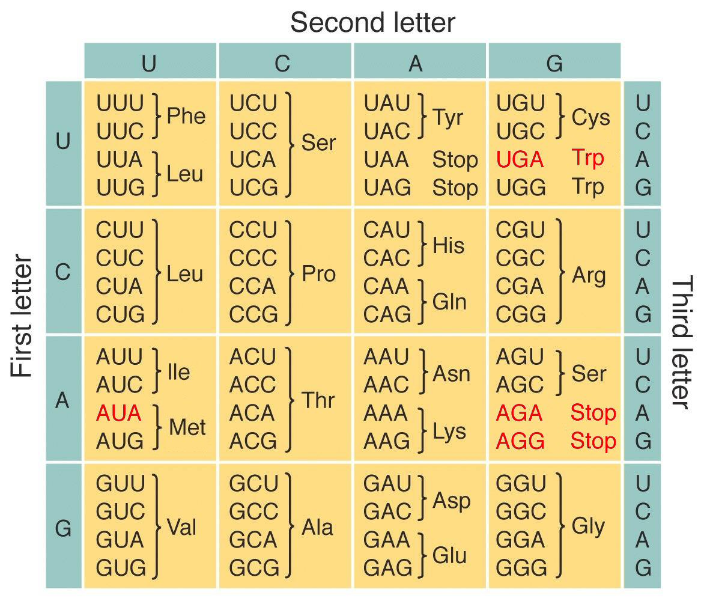

# Zadanie 1.

## Wprowadzenie

DNA, czyli kwas dezoksyrybonukleinowy, zawiera instrukcje syntezy
białek. Łańcuchy DNA składają się z *nukleotydów*. Nukleotydy
występują w 4 rodzajach. Sekwencję nukleotydów nazywamy *genem*.

*Kod genetyczny* to reguły tłumaczenia dowolnej sekwencji nukleotydów
na sekwencję aminokwasów w białku. Symbolami kodu genetycznego są
trójki kolejnych nukleotydów. Każda taka trójka nukleotydów koduje 1
aminokwas. Te trójki nukleotydów nazywamy *kodonami*.

Z 4 rodzajów nukleotydów można utworzyć 4**3 = 64 rodzaje kodonów, podczas gdy
w organizmach żywych występuje 20 aminokwasów. Dlatego większość aminokwasów
jest kodowana przez więcej niż 1 rodzaj kodonu. W skład kodu
genetycznego wchodzą też:

* *kodon START*, który oznacza początek genu
* *kodon STOP*, który oznacza koniec genu

Chociaż kod genetyczny wielu organizmów żywych jest taki sam, do tej
pory odkryto 27 odmian kodu genetycznego: tak zwany kod standardowy,
kod mitochondrialny kręgowców, kod mitochondrialny drożdży i inne.
Wszystkie te odmiany są dość podobne.

Na dzisiejszych zajęciach będą państwo pracować z kodem
mitochondrialnym kręgowców. Kod mitochondrialny kręgowców to reguły
tłumaczenia informacji genetycznej zawartej w mitochondrialnym DNA
(mDNA) na białka niezbędne do funkcjonowania mitochondriów.


Diagram pochodzi ze strony https://www.mun.ca/biology/scarr/MtDNA_code.html;
został opracowany na podstawie © Griffiths et al. 2004

## Przygotowanie

1. Proszę dodać do arkusza http://tiny.cc/at-lab5-2024 wiersz z
imionami i nazwiskami członków zespołu

1. Proszę wybrać dowolny gatunek ssaka

1. Proszę wpisać nazwę tego gatunku w kolumnie "Nazwa gatunku"
odpowiedniego wiersza arkusza http://tiny.cc/at-lab5-2024

1. Proszę wpisać w polu wyszukiwania "Search NCBI..." na stronie
https://www.ncbi.nlm.nih.gov/datasets/taxonomy/tree angielską lub
łacińską nazwę tego gatunku, a po niej wyraz "mitochondrion". Proszę
nie wpisywać tej nazwy w polu "Taxonomy Browser":-)

1. Proszę nacisnąć klawisz "Enter", aby przejść do następnej strony

1. Proszę nacisnąć przycisk "Download", aby rozwinąć menu

1. Proszę kliknąć w link "RefSeq complete genome" na tym menu, aby
pobrać plik w formacie FASTA, na przykład `NC_001655.2.fasta`

Każdy plik w formacie FASTA to plik tekstowy.

Pierwszy wiersz pliku zaczyna się od znaku `>` i zawiera identyfikator
sekwencji nukleotydów lub opis tej sekwencji, na przykład

```
>NC_001665.2 Rattus norvegicus strain BN/SsNHsdMCW mitochondrion, complete genome
```

Kolejne wiersze pliku zawierają sekwencję nukleotydów. Każdy znak
tej sekwencji odpowiada pojedynczemu nukleotydowi:

* A odpowiada takiemu nukleotydowi, który zawiera adeninę
* G odpowiada takiemu nukleotydowi, który zawiera guaninę
* C odpowiada takiemu nukleotydowi, który zawiera cytozynę
* T odpowiada takiemu nukleotydowi, który zawiera tyminę

1. Proszę wydać polecenie

```less nazwa_pliku_FASTA_z_DNA_mitochondrialnym```

aby zobaczyć na ekranie zawartość tego pliku.

1. Proszę ustalić z pozostałymi zespołami swojej grupy miejsce, w
   którym wszystkie zespoły państwa grupy będą przechowywać pobrane
   pliki z DNA mitochondrialnym. Pliki pobrane przez wszystkie zespoły
   państwa grupy przydadzą się w Zadaniu 2

1. Proszę skopiować pobrany plik w ustalone miejsce

1. Proszę utworzyć plik `fasta2txt` z taką zawartością:

```
#!/bin/bash

# Ten skrypt wypisuje do wyjścia wiersze pliku tekstowego podanego
# na wejściu, bez 1. wiersza i połączone w 1 wiersz

# `-n +2`: Skopiuj do wyjścia wszystkie wiersze wejścia od 2. wiersza
# `-d '\r\n'`: Skopiuj do wyjścia całe wejście bez znaków `\r` i `\n`

tail -n +2 | tr -d '\r\n'
```

1. Proszę wydać polecenie

```
chmod +x fasta2txt
```

aby plik `fasta2txt` stał się wykonywalny.

1. Proszę wydać polecenie

```
./fasta2txt < nazwa_pliku_FASTA_z_DNA_mitochondrialnym > mDNA.txt
```

1. Proszę wydać polecenie

```
wc mDNA.txt
```

Polecenie `wc` wypisuje liczbę znaków `\n`, wyrazów i bajtów w danym
pliku. Proszę wpisać liczbę z 3. kolumny wyjścia tego polecenia, czyli
liczbę bajtów w pliku `mDNA.txt`, w kolumnie "Liczba nukleotydów"
odpowiedniego wiersza arkusza http://tiny.cc/at-lab5-2024

## Testy jednostkowe

Podczas tej części zajęć opracują państwo testy jednostkowe i testy
wydajnościowe pakietów `github.com/mh739025250/suffix` i
`index/suffixarray`. Pakiet `github.com/mh739025250/suffix`
implementuje drzewa sufiksów, a pakiet `index/suffixarray`
implementuje tablice sufiksów.

1. Geny mitochondrialnego DNA kręgowców
składają się kolejno z:

* Kodonu START: ATG lub ATA
* Jednego lub więcej kodonów, do najbliższego kodonu STOP
* Kodonu STOP: TAA, TAG, AGA lub AGG

Proszę napisać taki regexp, do którego pasują geny
mitochondrialnego DNA kręgowców.

1. Proszę utworzyć plik `wytnij-geny` z taką zawartością:

```
grep -oP regexp,_do_którego_pasują_geny
```

Opcja `-o` oznacza: skopiuj do wyjścia te części wejścia, które pasują
do danego regexpa.

Opcja `-P` oznacza: włącz tryb rozszerzony wyrażeń regularnych. W
trybie rozszerzonym znaki regexpów można grupować przy pomocy
nawiasów. W trybie rozszerzonym można też korzystać z leniwego
kwantyfikatora `+?`

Kwantyfikator `+?` oznacza: dopasuj 1 lub więcej wystąpień regexpa,
który poprzedza ten kwantyfikator, tak mało razy jak to możliwe.

1. Proszę nadać plikowi `wytnij-geny` prawo do wykonywania

1. Proszę wydać polecenie

```
./wytnij-geny < mDNA.txt | sort -u > geny.txt
```

aby znaleźć geny w pliku `mDNA.txt` i zapisać je bez powtórzeń
do pliku `geny.txt`

Polecenie `sort -u` wypisuje do wyjścia 1 kopię każdego wiersza
wejścia. Dodatkowo sortuje te wiersze w porządku leksykograficznym.

1. Proszę opracować test jednostkowy pakietu **index/suffixarray**

W teście należy:

* Zbudować tablicę sufiksów wycinka bajtów, który odpowiada łańcuchowi
  `"ananas"`

* Stworzyć tablicę danych testowych. Każdy element tej tablicy
  powinien być strukturą, której pole `in` ma typ `string`, a pole
  `want` ma typ `[]int`. W polach `in` tych struktur powinny się
  znaleźć różne łańcuchy, i takie, które są podłańcuchami łańcucha
  `"ananas"`, i jeden taki, który nie jest podłańcuchem łańcucha
  `"ananas"`. W polach `want` tych struktur powinny się znaleźć
  oczekiwane wyniki funkcji `LookupAll`, czyli wycinki, których
  elementy to indeksy początków wystąpień łańcuchów `in` w łańcuchu
  `"ananas"` w kolejności rosnącej

* Dla każdego elementu tablicy danych testowych należy porównać
  rzeczywisty wynik funkcji `LookupAll` z oczekiwanym wynikiem tej
  funkcji. Jeśli te wyniki są różne, należy zgłosić błąd

Wskazówki:

* Warto zajrzeć do testów ../1/podziel_test.go lub ../2/transform_test.go

* Wypada sprawdzać, czy pliki wczytały się bez błędów

* Operacje na wycinkach: pakiet **slices**

* Operacje na wycinkach, których elementami są bajty: pakiet **bytes**

* Operacje na łańcuchach: pakiet **strings**

* Tak mogę czytać dokumentację pakietów i zawartości pakietów:

```
go doc bytes
go doc strings.Split
go doc index/suffixarray.Index
```

lub https://pkg.go.dev/

* Tak można utworzyć taki wycinek danego typu, który ma daną liczbę
  elementów, i zainicjować go wartościami zerowymi:

```
wycinek := make(typWycinka, długośćWycinka)
```

Wartości zerowe w Go to domyślne wartości, które są przypisywane
do zmiennych, na przykład:

    * `0` to wartość zerowa liczb
    * `nil` to wartość zerowa wskaźników
    * `[]T{}`, czyli pusty wycinek, to wartość zerowa wycinków

* Tak można konwertować typy:

```
var zero64 int64 = 0
zero := int(zero64)

var łańcuch = "jestem łańcuchem"
bajty := []byte(łańcuch)
łańcuch2 := string(bajty)
```

## Testy wydajnościowe

1. Proszę opracować testy wydajnościowe:
* pakietu **github.com/BobuSumisu/aho-corasick**
* pakietu **github.com/MarcinCiura/AT-lab/5/suffixarray**, który implementuje
  prosty algorytm tworzenia tablic sufiksów
* pakietu *index/suffixarray**, który implementuje algorytm tworzenia
  tablic sufiksów przez indukowane sortowanie; autorami tego algorytmu
  są See Ge Nong, Sen Zhang i Wai Hong Chen

Te testy mają mierzyć czas wyszukiwania wszystkich genów z pliku
`geny.txt` w pliku `mDNA.txt`

* Proszę napisać 6 funkcji:
  `Benchmark{AhoCorasick,SimpleSuffixArray,LibrarySuffixArray}{Build,Search}`

* W funkcjach
  `Benchmark{AhoCorasick,SimpleSuffixArray,LibrarySuffixArray}Build`
  proszę mierzyć tylko czas budowania odpowiednich struktur danych

* W funkcjach
  `Benchmark{AhoCorasick,SimpleSuffixArray,LibrarySuffixArray}Search`
  proszę zbudować odpowiednie struktury danych poza pętlą, a wewnątrz
  pętli proszę mierzyć tylko czas wyszukiwania genów

* Proszę sprawdzać, czy pliki wczytały się bez błędów

* Proszę zerować stoper tuż przed pętlą

* Proszę wpisać w odpowiednie komórki arkusza
  http://tiny.cc/at-lab5-2024 typ procesora i wyniki testów
  wydajnościowych wyrażone w mikrosekundach

Na przykład gdy program wypisał

```
goos: linux
goarch: amd64
pkg: github.com/MarcinCiura/AT-lab-priv/lab/5
cpu: Intel(R) Core(TM) i7-7820HQ CPU @ 2.90GHz
BenchmarkSimpleSuffixArrayBuild-8        1315	    867205 ns/op

PASS
ok      github.com/MarcinCiura/AT-lab/lab/5         2.878s
```

to w kolumnie "Model procesora", czyli w kolumnie K, należy wpisać
**i7-7820HQ**, a w kolumnie "Tablica sufiksów", czyli w kolumnie G,
należy wpisać **867**

## Zakończenie

* Proszę się uśmiechnąć :-)

# Zadanie 2

Proszę napisać program, który znajduje najdłuższą sekwencję DNA
mitochondrialnego wspólną dla wszystkich zwierząt wybranych przez
osoby z państwa grupy :-)
